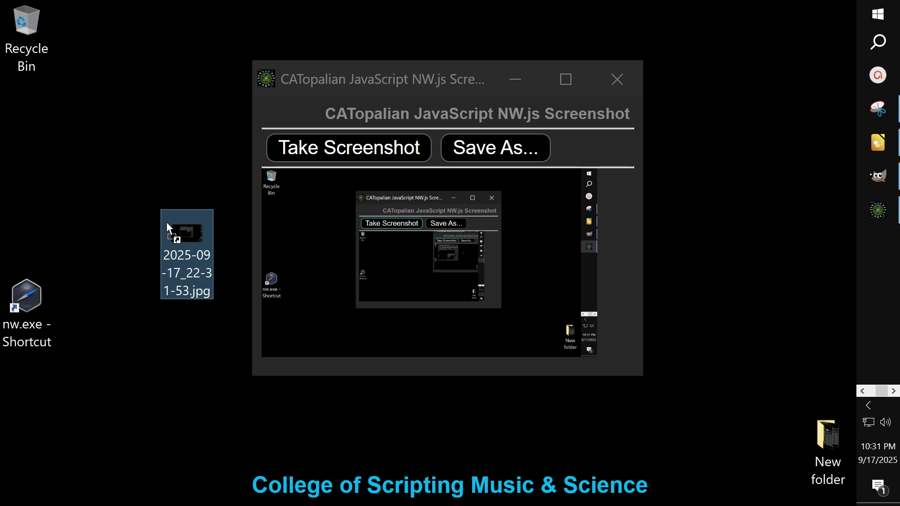

# CATopalian JavaScript NW.js Screenshot
A JavaScript NW.js Node.js application that can take and save screenshots

---

Video: https://www.youtube.com/watch?v=OlEfX3MmYNw

---

REQUIREMENTS:

NW.js  
https://nwjs.io/  

---

To run this application we:
* Download NW.js
* Extract All
* Find the nw.exe icon
* Drag the folder named CATopalian_JavaScript_NW.js_Screenshot onto the nw.exe icon  

Full Instructions on Running our app here: https://github.com/ChristopherAndrewTopalian/CATopalian_JavaScript_NW.js

---

### How to Download this App
1. Click the green Code Button on this github page
2. Choose Download ZIP
3. Save the Zip File
4. Extract All
5. Drag the CATopalian_JavaScript_NW.js_Screenshot Folder on to the nw.exe to start the App

---

Happy Scripting :-)

